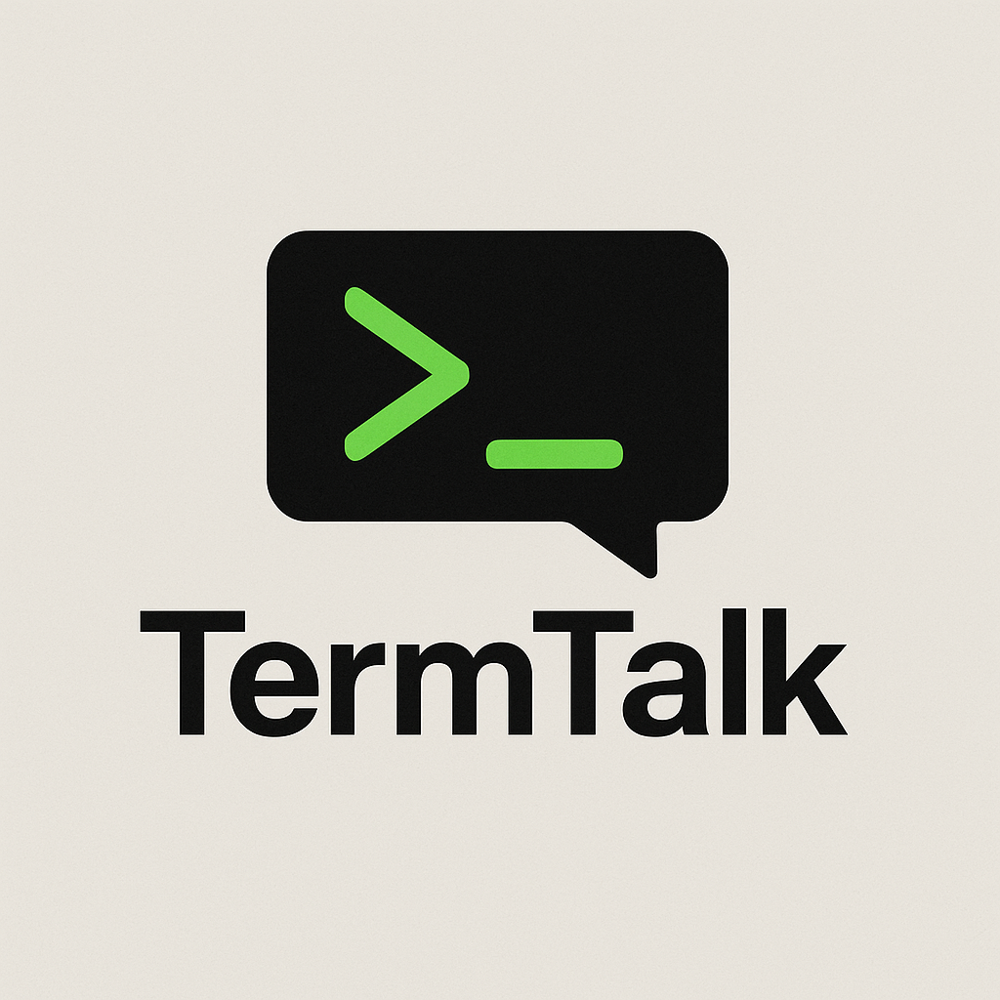

## Chat like a hacker. Terminal-style group messaging for developers.

Me and my friends wanted a way to talk during university lectures that made it look like we were doing work—introduce TermTalk!

## How It Works

- `$ Join a session via a code (or create an existing one)`
- `$ Copy a curl command in your terminal`
- `$ Send messages in real-time via WebSocket`

## Running Locally

```bash
npm install
npm run dev
```
